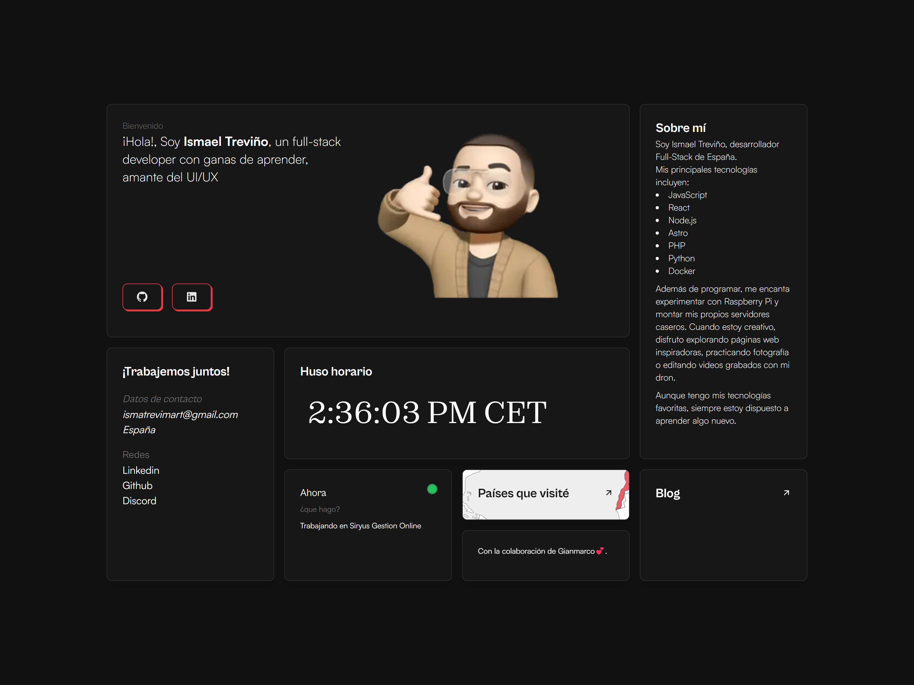

# ⚡️astro-bento-portfolio

## A personal portfolio website made using `Astro`.

To view a my portfolio **[click here](https://ismola.dev)**

## Features

- Modern and Minimal bento-like, 2sleek UI Design
- All in one page (almost)
- Fully Responsive
- Performances and SEO optimizations
- Ready to be deployed on [Netlify](https://www.netlify.com/)
- Blog
- RSS support (your-domain/rss.xml)
- Cool 3d globe

## Tech Stack

- [Astro](https://astro.build)
- [unocss](https://unocss.dev/)
- [motion](https://motion.dev/)
- [d3](https://d3js.org/)

## Authors ❤️

- Gianmarco - https://github.com/Ladvace
